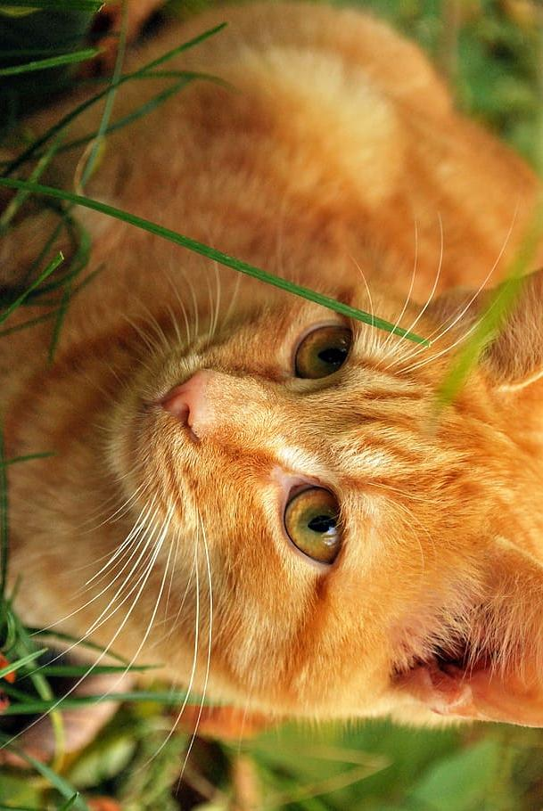
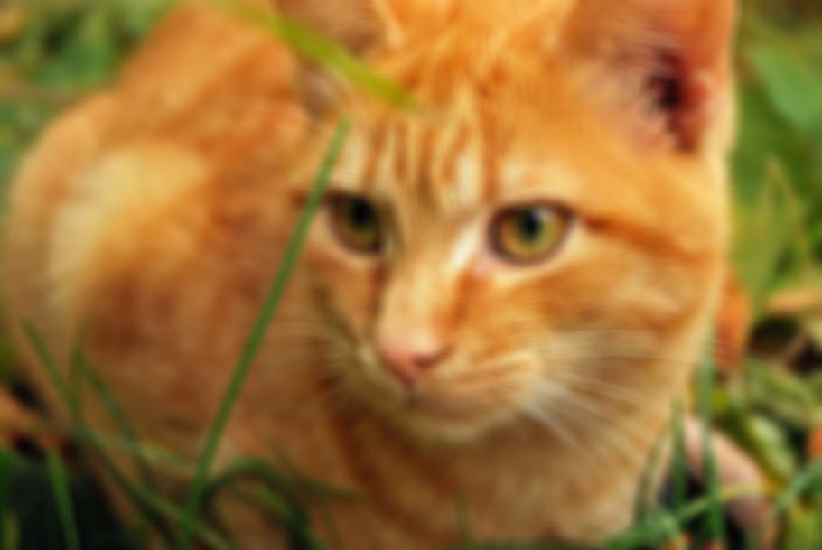
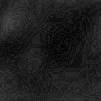

# Image-Processing
## Computer Science java task ;

### Stage 1:

I need to Implement the following Classes that implements Frame:

**RGBImage:**<ul>
	<li> Colored image that contain 3 dimensions [3][height][weight].</li>
	<li> the first dimension contain the rgb color = {red, green, blue};</li>
</ul>

**GrayImage:**<ul>
	<li> Black-White image that contain 2 dimension [height][weight] </li>
	<li> the value is how strong you want your gray to become. (more = lighter) </li>
</ul>	

We need to implement the following functions in the classes:
<ul>
	<li><b>2 builders</b> (1: that gets array of pixels, 2: A copy builder)</li>
	<li><b>getFrame()</b> // returns the array of pixels</li>
	<li><b>rotate90()</b> // rotate the picture 90 digress</li>
	<li><b>smooth(int n)</b> // check the n amount of neighbers and get the average of the value of the pixels</li>
	<li><b>getPixel(int x, int y)</b> // return the value in the pixel [x][y]</li>
	<li><b>crop(int x, int y )</b> // crop the image from (0,0) to (x,y)</li>
	<li><b>addFrom(Frame f)</b> // add from Frame f the value of each pixel to the correct position in this.frame (if not the same instance or size it will do nothing)</li>
	<li><b>compareTo(Frame f)</b> // compare between 2 sizes of frames. height * weight</li>
</ul>	

### Stage 2:

I need to Implement a container that contains array of frames.

We need to implement the following functions:
<ul>
	<li><b>Frame get(int i)</b> // get the frame from position i in the array.</li></li>
	<li><b>int size()</b> // return the amount of frames the array is storing.</li>
	<li><b>void Add(Frame f)</b> // add Frame f to the array. and make it dynamic.</li>
	<li><b>void remove(Frame f)</b> // delete Frame f if existing in the array. and make it dynamic.</li>
	<li><b>void Sort(Frame[] f)</b> // Sort the Frames in f, by the size of them (height * weight)</li>
	<li><b>void RotateAll(Frame[] f)</b> // Rotate all of the frames 90 digress.</li>
	<li><b>void smoothAll(Frame[] f, int n)</b> smooth all of the frames by the number of neighbers n.</li>
</ul>

### Stage 3:

Create 5 Junit tests for all the functions.
